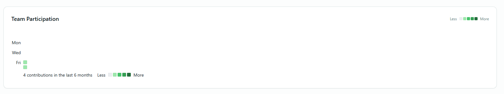
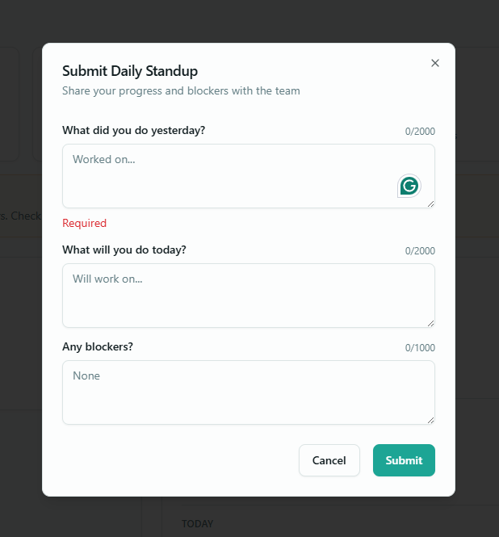
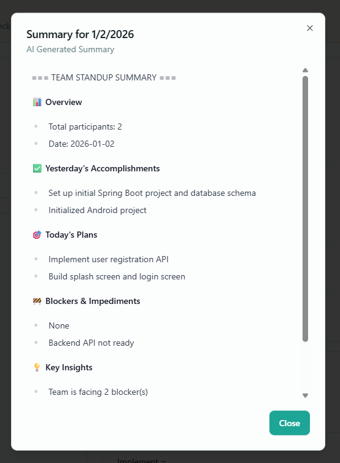
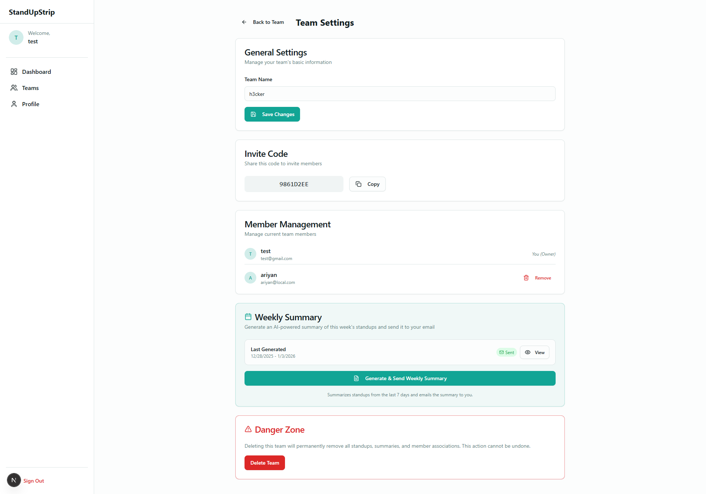
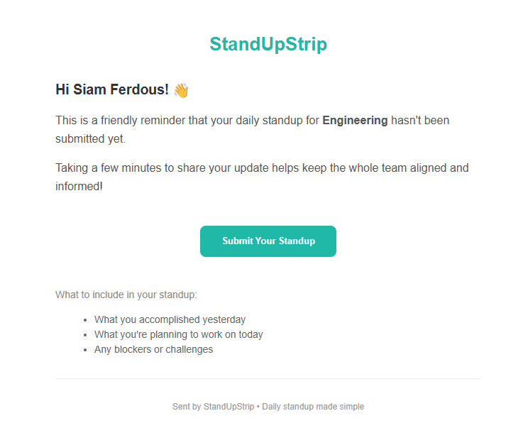
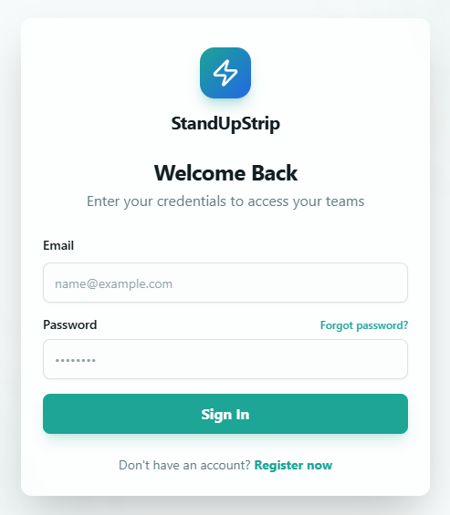
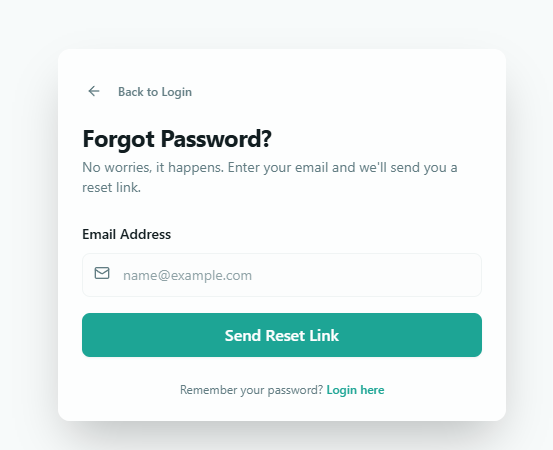
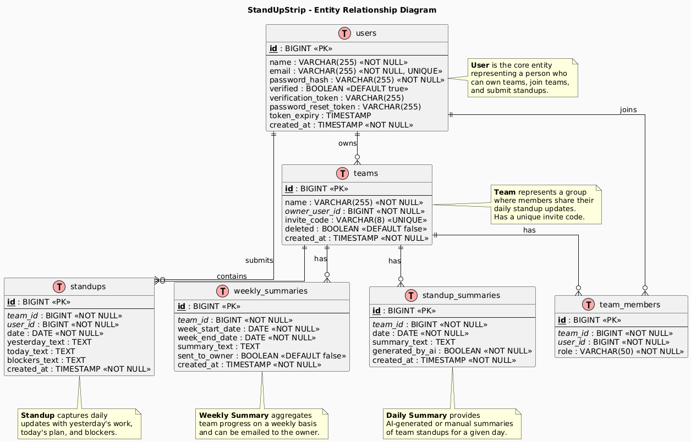
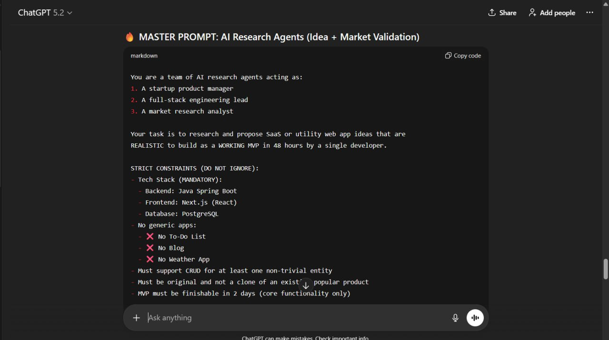

# StandUpStrip

> *"Daily standups without the daily meeting."*

**StandUpStrip** is a lightweight async standup tool that lets remote teams submit daily updates and get AI-powered summaries—replacing fragmented Slack threads and eliminating daily standup meetings.

## ✨ Features

- **User Authentication** — Email/password with JWT, email verification, and password reset
- **Team Management** — Create teams, invite members via code, manage settings
- **Daily Standups** — Submit Yesterday/Today/Blockers updates
- **AI Summaries** — One-click daily & weekly AI-generated summaries (Google Gemini)
- **Participation Heatmap** — GitHub-style activity visualization
- **Secure Team Deletion** — Password verification for destructive actions
### 🎬 Complete Workflow Demo

[](https://drive.google.com/drive/folders/1BUalizSjrSjn9EvcnxDgb7CS1eRXb3sD?usp=sharing)

> **📺 [Click here to watch the complete workflow video](https://drive.google.com/drive/folders/1BUalizSjrSjn9EvcnxDgb7CS1eRXb3sD?usp=sharing)**


## � Screenshots

### Dashboard & Activity



### Standups & AI Reports



### Management & Notifications



### Authentication
<p float="left">
  
   
  
</p>


## �🛠️ Tech Stack

| Layer | Technology |
|-------|------------|
| Frontend | Next.js 15, React 19, Tailwind CSS, shadcn/ui |
| Backend | Spring Boot 4, Java 21 |
| Database | PostgreSQL |
| AI | Google Gemini API |
| Auth | JWT |

---
 
 ## 📊 Database Schema
 
 
 
 ---

## 🚀 Setup Instructions

### Prerequisites

- **Node.js** 18+ and npm
- **Java** 21 (JDK)
- **PostgreSQL** 14+
- **Gemini API Key** (from [Google AI Studio](https://aistudio.google.com/))

---

### 1. Clone the Repository

```bash
git clone <repository-url>
cd Trainee_Siam
```

---

### 2. Database Setup

Create a PostgreSQL database:

```sql
CREATE DATABASE standupdb;
```

---

### 3. Backend Setup (Spring Boot)

```bash
cd backend
```

#### Configure Environment Variables

Create a `.env` file or set environment variables:

```bash
# Database
DATABASE_URL=jdbc:postgresql://localhost:5432/standupdb
DATABASE_USERNAME=your_postgres_username
DATABASE_PASSWORD=your_postgres_password

# JWT
JWT_SECRET=your_secure_jwt_secret_key_at_least_256_bits
JWT_EXPIRATION=86400000

# Gemini AI
GEMINI_API_KEY=your_gemini_api_key

# Email (Gmail SMTP)
MAIL_USERNAME=your_email@gmail.com
MAIL_PASSWORD=your_app_password

# Frontend URL
FRONTEND_URL=http://localhost:3000
```

#### Run the Backend

```bash
./mvnw spring-boot:run
```

The backend will start at **http://localhost:8080**

---

### 4. Frontend Setup (Next.js)

```bash
cd frontend
```

#### Install Dependencies

```bash
npm install
```

#### Configure Environment (optional)

Create `.env.local` if you need to change the API URL:

```bash
NEXT_PUBLIC_API_URL=http://localhost:8080
```

#### Run the Frontend

```bash
npm run dev
```

The frontend will start at **http://localhost:3000**

---

## 📁 Project Structure

```
Trainee_Siam/
├── backend/                 # Spring Boot API
│   ├── src/main/java/      # Java source code
│   │   └── com/siamcode/backend/
│   │       ├── controller/ # REST controllers
│   │       ├── service/    # Business logic
│   │       ├── entity/     # JPA entities
│   │       ├── repository/ # Data access
│   │       └── security/   # JWT authentication
│   └── src/main/resources/ # Configuration files
├── frontend/               # Next.js application
│   ├── app/               # App Router pages
│   ├── components/        # React components
│   ├── contexts/          # React contexts
│   └── lib/               # Utilities
└── docs/                  # Documentation
    ├── PRD.md            # Product Requirements
    └── er_diagram.puml   # Database ER diagram
```

---

## 🤖 AI Log


For a comprehensive, step-by-step log of how AI was used to build this application, please refer to the **[AI Log](docs/AI_LOG.md)**.

### 🧠 Proof of Ideation

*   **[Finding 5 Ideas (PDF)](docs/proof_of_ideation/proof.pdf)** — Initial brainstorming and concept selection.
*   **Master Prompt** — The core prompt used to drive the AI development:
    
