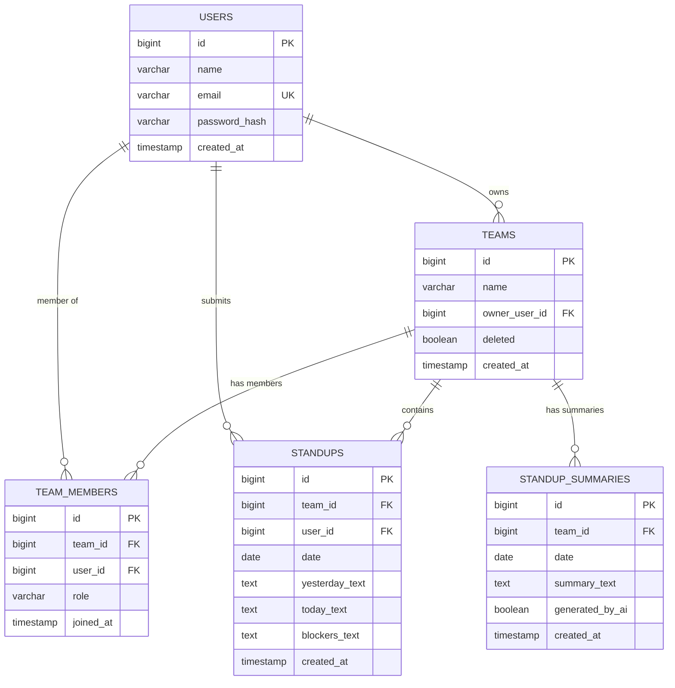

# StandUpStrip Database Schema Documentation

## Schema Diagram


## Tables Overview

### 1. Users Table
**Purpose**: Store user authentication and profile information

| Column | Type | Constraints | Description |
|--------|------|-------------|-------------|
| id | BIGSERIAL | PRIMARY KEY | Auto-incrementing user ID |
| name | VARCHAR(255) | NOT NULL | User's display name |
| email | VARCHAR(255) | NOT NULL, UNIQUE | User's email (login) |
| password_hash | VARCHAR(255) | NOT NULL | Bcrypt password hash |
| created_at | TIMESTAMP | NOT NULL, DEFAULT NOW() | Account creation timestamp |
| updated_at | TIMESTAMP | DEFAULT NOW() | Last profile update |

**Indexes**:
- `idx_users_email` on `email` (for fast login lookups)

---

### 2. Teams Table
**Purpose**: Store team information with soft delete support

| Column | Type | Constraints | Description |
|--------|------|-------------|-------------|
| id | BIGSERIAL | PRIMARY KEY | Auto-incrementing team ID |
| name | VARCHAR(255) | NOT NULL | Team name |
| owner_user_id | BIGINT | NOT NULL, FK → users.id | Team owner reference |
| created_at | TIMESTAMP | NOT NULL, DEFAULT NOW() | Team creation timestamp |
| updated_at | TIMESTAMP | DEFAULT NOW() | Last team update |
| deleted | BOOLEAN | NOT NULL, DEFAULT FALSE | Soft delete flag |
| deleted_at | TIMESTAMP | | Deletion timestamp |

**Indexes**:
- `idx_teams_owner` on `owner_user_id`
- `idx_teams_deleted` on `deleted` (filter active teams)

**Foreign Keys**:
- `owner_user_id` → `users.id` (CASCADE on delete)

---

### 3. Team Members Table
**Purpose**: Many-to-many relationship between teams and users

| Column | Type | Constraints | Description |
|--------|------|-------------|-------------|
| id | BIGSERIAL | PRIMARY KEY | Auto-incrementing ID |
| team_id | BIGINT | NOT NULL, FK → teams.id | Team reference |
| user_id | BIGINT | NOT NULL, FK → users.id | User reference |
| role | VARCHAR(50) | NOT NULL, DEFAULT 'MEMBER' | Role (OWNER/ADMIN/MEMBER) |
| joined_at | TIMESTAMP | NOT NULL, DEFAULT NOW() | Membership start time |

**Constraints**:
- `UNIQUE(team_id, user_id)` - Prevent duplicate memberships

**Indexes**:
- `idx_team_members_team` on `team_id`
- `idx_team_members_user` on `user_id`

**Foreign Keys**:
- `team_id` → `teams.id` (CASCADE on delete)
- `user_id` → `users.id` (CASCADE on delete)

---

### 4. Standups Table
**Purpose**: Store daily standup submissions from team members

| Column | Type | Constraints | Description |
|--------|------|-------------|-------------|
| id | BIGSERIAL | PRIMARY KEY | Auto-incrementing standup ID |
| team_id | BIGINT | NOT NULL, FK → teams.id | Team reference |
| user_id | BIGINT | NOT NULL, FK → users.id | Submitter reference |
| date | DATE | NOT NULL | Standup date |
| yesterday_text | TEXT | | What was done yesterday |
| today_text | TEXT | | What's planned for today |
| blockers_text | TEXT | | Current blockers |
| created_at | TIMESTAMP | NOT NULL, DEFAULT NOW() | Submission time |
| updated_at | TIMESTAMP | DEFAULT NOW() | Last update time |

**Constraints**:
- `UNIQUE(team_id, user_id, date)` - One standup per user per day per team

**Indexes**:
- `idx_standups_team_date` on `(team_id, date)` (fast date queries)
- `idx_standups_user` on `user_id`
- `idx_standups_date` on `date`

**Foreign Keys**:
- `team_id` → `teams.id` (CASCADE on delete)
- `user_id` → `users.id` (CASCADE on delete)

---

### 5. Standup Summaries Table
**Purpose**: Store AI-generated daily summaries for teams

| Column | Type | Constraints | Description |
|--------|------|-------------|-------------|
| id | BIGSERIAL | PRIMARY KEY | Auto-incrementing summary ID |
| team_id | BIGINT | NOT NULL, FK → teams.id | Team reference |
| date | DATE | NOT NULL | Summary date |
| summary_text | TEXT | NOT NULL | AI-generated summary |
| created_at | TIMESTAMP | NOT NULL, DEFAULT NOW() | Generation time |
| generated_by_ai | BOOLEAN | NOT NULL, DEFAULT TRUE | AI generation flag |

**Constraints**:
- `UNIQUE(team_id, date)` - One summary per team per day

**Indexes**:
- `idx_summaries_team_date` on `(team_id, date)`
- `idx_summaries_date` on `date`

**Foreign Keys**:
- `team_id` → `teams.id` (CASCADE on delete)

---

## Relationships



---

## Key Design Decisions

### Soft Deletes
Teams use a `deleted` boolean flag rather than hard deletes to preserve historical data. Queries filter by `deleted = FALSE`.

### Unique Constraints
- **Users**: Email must be unique (authentication)
- **Team Members**: Each user can only be added to a team once
- **Standups**: One standup per user per team per day
- **Summaries**: One summary per team per day

### Cascading Deletes
When a user or team is deleted, all related records cascade delete:
- Delete user → deletes team_members, standups
- Delete team → deletes team_members, standups, summaries

### Indexes
Optimized for common queries:
- Email lookups (login)
- Team member lookups
- Date-range standup queries (last 7 days)

---

## Migration Notes

For production deployment, consider:
1. **Flyway/Liquibase** for version-controlled migrations
2. **Audit columns** (created_by, updated_by) for compliance
3. **Partitioning** on `standups.date` if scaling to 100+ teams
4. **Read replicas** for reporting queries

---

## Sample Queries

### Get all active teams for a user
```sql
SELECT t.* 
FROM teams t
JOIN team_members tm ON t.id = tm.team_id
WHERE tm.user_id = ? AND t.deleted = FALSE;
```

### Get today's standups for a team
```sql
SELECT s.*, u.name as user_name
FROM standups s
JOIN users u ON s.user_id = u.id
WHERE s.team_id = ? AND s.date = CURRENT_DATE;
```

### Get last 7 days of summaries
```sql
SELECT * FROM standup_summaries
WHERE team_id = ? 
  AND date >= CURRENT_DATE - INTERVAL '7 days'
ORDER BY date DESC;
```
