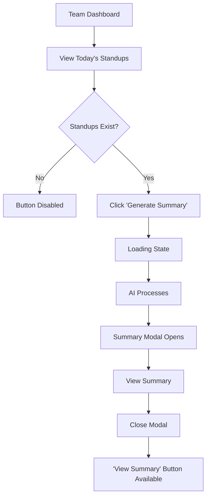

# StandUpStrip — Product Requirements Document (PRD)

**Version:** 1.1  
**Date:** January 2026  
**Author:** Product Team  
**Status:** Implemented

---

## Table of Contents
1. [Executive Summary](#executive-summary)
2. [Problem Statement](#problem-statement)
3. [Target Users & Personas](#target-users--personas)
4. [Product Vision](#product-vision)
5. [MVP Feature Specification](#mvp-feature-specification)
6. [User Stories](#user-stories)
7. [User Flows](#user-flows)
8. [UI/UX Specifications](#uiux-specifications)
9. [Technical Architecture](#technical-architecture)
10. [API Contracts](#api-contracts)
11. [Database Schema](#database-schema)
12. [AI Integration Specification](#ai-integration-specification)
13. [Non-Functional Requirements](#non-functional-requirements)
14. [Success Metrics](#success-metrics)
15. [Risks & Mitigations](#risks--mitigations)
16. [Future Roadmap](#future-roadmap)
17. [Appendix](#appendix)

---

## Executive Summary

### Product Name
**StandUpStrip**

### Tagline
*"Daily standups without the daily meeting."*

### Elevator Pitch
StandUpStrip is a lightweight async standup tool that lets remote teams submit daily updates and get AI-powered summaries—replacing fragmented Slack threads and eliminating daily standup meetings.

### MVP Scope
A 48-hour buildable MVP focusing on:
- User authentication with email verification
- Password reset flow
- Team management with invite codes
- Team settings with secure deletion (password verification)
- Daily standup submission (Yesterday/Today/Blockers)
- Team standup dashboard
- One-click AI summary generation (Daily & Weekly)
- 7-day history view
- Participation heatmap

---

## Problem Statement

### The Problem
Remote teams drown in fragmented standup updates scattered across Slack, WhatsApp, and video calls. No single place provides a clean daily summary without heavyweight project management tools.

### Current Pain Points

| Pain Point | Description | Impact |
|------------|-------------|--------|
| **Scattered Updates** | Standups disappear in Slack feeds within hours | Managers waste 20+ min/day scrolling for context |
| **Tool Overkill** | Jira/Linear/Asana are complex just to track 3 questions | Teams resist adoption; data becomes stale |
| **Meeting Fatigue** | 15-min daily syncs across timezones fragment deep work | 1.25 hrs/week per person wasted on coordination |
| **No Summary Layer** | No tool synthesizes "what happened today" automatically | Stakeholders always feel out of the loop |
| **Configuration Burden** | Existing standup bots require Slack workspace setup | Small teams skip it; lose visibility |

### Why Now?
- Remote work is permanent for 30%+ of knowledge workers
- AI summarization is now cheap and fast (< $0.01/summary)
- Teams want async-first workflows, not more meetings

---

## Target Users & Personas

### Primary Persona: Tech Team Lead

```
Name: Sarah, 32
Role: Engineering Team Lead
Company: 15-person seed-stage startup
Team: 5 developers, 2 designers

GOALS:
- Know what everyone's working on without interrupting them
- Identify blockers before they become delays
- Give stakeholders a quick progress update weekly

FRUSTRATIONS:
- Hates parsing Slack #standup channel
- Daily syncs kill morning focus time
- Jira is "too much" for a team this size

QUOTE:
"I just want to know: what happened yesterday, what's happening today, 
and is anyone stuck—without scheduling another meeting."
```

### Secondary Persona: Startup Founder

```
Name: Mike, 28
Role: Co-founder / CEO
Company: 8-person pre-seed startup
Team: Entire company

GOALS:
- Weekly visibility into all team activities
- Spot-check blockers across functions
- Avoid micromanaging while staying informed

FRUSTRATIONS:
- Too busy to attend every standup
- Asking "what's everyone working on?" feels micromanage-y
- No time to configure complex tools

QUOTE:
"I want a TL;DR of what happened this week without reading 50 messages."
```

### Tertiary Persona: Remote Developer

```
Name: Alex, 26
Role: Full-stack Developer
Company: Remote-first agency
Team: Rotates across 3 client projects

GOALS:
- Share progress without sync meetings
- Get visibility into what teammates are doing
- Flag blockers without escalating awkwardly

FRUSTRATIONS:
- Standup meetings interrupt flow state
- Forgets what they did yesterday
- Hates typing same update in Slack AND elsewhere

QUOTE:
"Let me type my update once, somewhere it won't get buried, and be done."
```

---

## Product Vision

### Vision Statement
> StandUpStrip becomes the default way small teams share daily progress—replacing meetings with a 60-second form and an AI summary.

### Design Principles

| Principle | Description |
|-----------|-------------|
| **Speed Over Features** | Submit a standup in < 60 seconds |
| **Zero Configuration** | Works out of the box; no Slack integration required |
| **Summary First** | AI summary is the default view; details on demand |
| **Async Native** | No real-time features; designed for timezone diversity |
| **Minimal Friction** | No approval workflows, no complex permissions |

---

## MVP Feature Specification

### Feature Overview

| Feature | Priority | Complexity | Status |
|---------|----------|------------|--------|
| User Authentication | P0 | Low | ✅ Done |
| Email Verification | P0 | Medium | ✅ Done |
| Password Reset Flow | P1 | Medium | ✅ Done |
| Team Creation & Management | P0 | Low | ✅ Done |
| Team Settings (Secure Deletion) | P0 | Medium | ✅ Done |
| Member Invitation (via code) | P0 | Low | ✅ Done |
| Standup Submission Form | P0 | Low | ✅ Done |
| Daily Standup Dashboard | P0 | Medium | ✅ Done |
| AI Summary Generation (Daily) | P0 | Medium | ✅ Done |
| Weekly AI Summary | P1 | Medium | ✅ Done |
| 7-Day History View | P1 | Low | ✅ Done |
| Participation Heatmap | P1 | Medium | ✅ Done |
| User Profile | P2 | Low | ✅ Done |

---

### F1: User Authentication

**Description:** Email/password authentication with JWT tokens, email verification, and password reset.

**Acceptance Criteria:**
- [x] User can register with name, email, password
- [x] User can login with email/password
- [x] JWT token issued with 24-hour expiration
- [x] Passwords hashed with bcrypt (min 10 rounds)
- [x] Email must be unique (case-insensitive)
- [x] Password minimum 8 characters
- [x] Email verification on registration
- [x] Resend verification email option
- [x] Forgot password flow with email token
- [x] Password reset with token validation

**UI Elements:**
- Registration form: Name, Email, Password, Confirm Password
- Login form: Email, Password
- Forgot Password page with email input
- Reset Password page with new password input
- Email Verification page
- Profile page with verified badge & resend verification button

---

### F2: Team Creation & Management

**Description:** Users can create teams and become the owner.

**Acceptance Criteria:**
- [x] User can create a team with a name
- [x] Creator becomes team owner automatically
- [x] Owner added as team member with OWNER role
- [x] Team gets auto-generated 8-character invite code
- [x] Owner can view invite code
- [x] Owner can regenerate invite code
- [x] Owner can rename team
- [x] Owner can delete team (soft delete with password verification)
- [x] Owner can remove team members

**Business Rules:**
- One user can own multiple teams
- One user can be member of multiple teams
- Deleted teams hidden from all views
- Team deletion requires password confirmation for security

---

### F3: Member Invitation

**Description:** Team members join via shareable invite code.

**Acceptance Criteria:**
- [x] Invite code displayed on team page (owner only)
- [x] "Copy Invite Link" button
- [x] /join/[code] page shows team name + "Join Team" button
- [x] User must be logged in to join
- [x] User cannot join same team twice
- [x] New members get MEMBER role

**Simplified Design (MVP):**
- No email invitation flow
- No approval workflow
- Anyone with code can join

---

### F4: Standup Submission

**Description:** Team members submit daily standup with 3 fields.

**Acceptance Criteria:**
- [x] Form with 3 text areas: Yesterday, Today, Blockers
- [x] Blockers field is optional
- [x] One standup per user per team per day
- [x] User can edit their standup if submitted today
- [x] User can delete their own standup
- [x] Timestamp shown on submission
- [x] Character counter for each field

**Field Specifications:**

| Field | Label | Placeholder | Required | Max Length |
|-------|-------|-------------|----------|------------|
| yesterday_text | "What did you do yesterday?" | "Completed API integration..." | Yes | 2000 chars |
| today_text | "What will you do today?" | "Working on user dashboard..." | Yes | 2000 chars |
| blockers_text | "Any blockers?" | "Waiting on design review..." | No | 1000 chars |

---

### F5: Daily Standup Dashboard

**Description:** View all team standups for a given day.

**Acceptance Criteria:**
- [x] Default view: Today's standups
- [x] Date picker to view other days
- [x] Card per team member showing their standup
- [x] "No standup submitted" indicator for missing members (pending visualization)
- [x] Quick buttons: Today, Yesterday
- [x] Member avatar/initial + name on each card
- [x] Responsive mobile design

**Card Layout:**
```
┌─────────────────────────────────────┐
│ [S] Sarah Chen          10:32 AM    │
├─────────────────────────────────────┤
│ Yesterday:                          │
│ Completed auth module + tests       │
│                                     │
│ Today:                              │
│ Starting payment integration        │
│                                     │
│ Blockers:                           │
│ Need Stripe API keys from Mike      │
└─────────────────────────────────────┘
```

---

### F6: AI Summary Generation

**Description:** One-click generation of team standup summary (daily and weekly).

**Acceptance Criteria:**
- [x] "Generate Summary" button on dashboard
- [x] Button disabled if no standups for selected date
- [x] AI generates summary from all team standups
- [x] Summary includes: Overview, Key Themes, Blockers
- [x] Summary stored in database
- [x] "View Summary" button replaces "Generate" after creation
- [x] Summary displayed in modal
- [x] Weekly summary generation for team owners
- [x] Weekly summary email notification to owner

**AI Output Format:**
```
## Team Summary — January 2, 2026

### Overview
The team made progress on frontend development and API integration. 
3 of 5 team members submitted standups.

### Key Themes
- **Frontend:** Dashboard UI completion (Sarah, Alex)
- **Backend:** Payment integration research (Mike)

### Blockers
1. **API Keys Needed** — Mike needs Stripe keys (raised by Sarah)
2. **Design Review** — Waiting on mobile mockups (raised by Alex)
```

---

### F7: 7-Day History View

**Description:** View standups and summaries from past 7 days.

**Acceptance Criteria:**
- [x] Calendar/date picker showing last 7 days
- [x] Click date to view that day's standups
- [x] Indicator showing which days have standups
- [x] Indicator showing which days have AI summaries
- [x] Available to all team members

---

### F8: Participation Heatmap

**Description:** GitHub-style contribution graph showing team activity.

**Acceptance Criteria:**
- [x] Visual heatmap of standup submissions over last 6 months
- [x] Color intensity based on number of standups submitted that day
- [x] Tooltip on hover showing precise count (e.g., "5 standups on Jan 2")
- [x] Empty state for days with zero activity (gray)
- [x] Accessible color palette (Green scale by default)
- [x] Member filter to view individual participation

**API Requirements:**
- [x] GET /api/stats/teams/{teamId}/heatmap endpoint
- [x] Optimized query to handle year-long data efficiently

---

### F9: Team Settings Page

**Description:** Team owner management interface with secure actions.

**Acceptance Criteria:**
- [x] Rename team functionality
- [x] View and regenerate invite code
- [x] Member list with remove option
- [x] Secure team deletion with password verification
- [x] Owner-only access control

---

### F10: Weekly Summary

**Description:** AI-generated weekly rollup of team standups for team owners.

**Acceptance Criteria:**
- [x] Generate weekly summary button (owner only)
- [x] Aggregates all standups from the week
- [x] AI generates comprehensive weekly overview
- [x] Email notification sent to team owner
- [x] View past weekly summaries

---

## User Stories

### Epic 1: Authentication

| ID | Story | Priority | Status |
|----|-------|----------|--------|
| US1.1 | As a new user, I can register with my email so that I can access the app | P0 | ✅ |
| US1.2 | As a registered user, I can login so that I can view my teams | P0 | ✅ |
| US1.3 | As a logged-in user, I can logout to secure my session | P0 | ✅ |
| US1.4 | As a new user, I can verify my email to activate my account | P0 | ✅ |
| US1.5 | As a user, I can reset my password if I forget it | P1 | ✅ |
| US1.6 | As a user, I can resend verification email if needed | P1 | ✅ |

### Epic 2: Team Management

| ID | Story | Priority | Status |
|----|-------|----------|--------|
| US2.1 | As a user, I can create a team so that my team can share standups | P0 | ✅ |
| US2.2 | As a team owner, I can see the invite code so I can share it with teammates | P0 | ✅ |
| US2.3 | As a user, I can join a team with an invite code so I can participate | P0 | ✅ |
| US2.4 | As a team owner, I can remove a member so I can manage my team | P1 | ✅ |
| US2.5 | As a team owner, I can rename my team to update its identity | P2 | ✅ |
| US2.6 | As a team owner, I can regenerate the invite code for security | P1 | ✅ |
| US2.7 | As a team owner, I can delete the team with password confirmation | P1 | ✅ |

### Epic 3: Standups

| ID | Story | Priority | Status |
|----|-------|----------|--------|
| US3.1 | As a team member, I can submit my daily standup so my team knows my progress | P0 | ✅ |
| US3.2 | As a team member, I can view all team standups for today | P0 | ✅ |
| US3.3 | As a team member, I can edit my standup if I submitted it today | P1 | ✅ |
| US3.4 | As a team member, I can delete my own standup | P2 | ✅ |

### Epic 4: AI Summaries

| ID | Story | Priority | Status |
|----|-------|----------|--------|
| US4.1 | As a team member, I can generate an AI summary for today's standups | P0 | ✅ |
| US4.2 | As a team member, I can view previously generated summaries | P0 | ✅ |
| US4.3 | As a team owner, I can view summaries from the last 7 days | P1 | ✅ |
| US4.4 | As a team owner, I can generate weekly summary for the team | P1 | ✅ |

### Epic 5: Analytics

| ID | Story | Priority | Status |
|----|-------|----------|--------|
| US5.1 | As a team member, I can view a participation heatmap | P1 | ✅ |
| US5.2 | As a team member, I can filter heatmap by specific member | P2 | ✅ |

---

## User Flows

### Flow 1: New User Onboarding


### Flow 2: Daily Standup Submission


### Flow 3: Generate AI Summary



---

## UI/UX Specifications

### Page Structure

```
├── /                    → Landing page (marketing)
├── /login               → Login form
├── /register            → Registration form
├── /forgot-password     → Forgot password form
├── /reset-password      → Reset password with token
├── /verify              → Email verification page
├── /dashboard           → List of user's teams
├── /teams/[id]          → Team standup dashboard
├── /teams/[id]/settings → Team settings (owner only)
├── /join/[code]         → Join team via invite code
└── /profile             → User profile (name update, verification status)
```

### Wireframes

#### Dashboard (Empty State)
```
┌─────────────────────────────────────────────────────────────┐
│  STANDUPSTRIP                                    [Profile ▼] │
├─────────────────────────────────────────────────────────────┤
│                                                              │
│    ┌──────────────────────────────────────────────────┐     │
│    │                                                  │     │
│    │              📋 No teams yet                     │     │
│    │                                                  │     │
│    │     Create your first team or join one          │     │
│    │     with an invite code                          │     │
│    │                                                  │     │
│    │   [ Create Team ]    [ Join Team ]              │     │
│    │                                                  │     │
│    └──────────────────────────────────────────────────┘     │
│                                                              │
└─────────────────────────────────────────────────────────────┘
```

#### Team Dashboard
```
┌─────────────────────────────────────────────────────────────┐
│  ← Back    Team Alpha                         [⚙ Settings] │
├─────────────────────────────────────────────────────────────┤
│                                                              │
│  [ Submit Standup ]    Date: [Jan 2, 2026 ▼]                │
│                        [Today] [Yesterday]                   │
│                                                              │
│  ┌──────────────────────────────────────────────────┐       │
│  │ Summary: ✨ Available    [View Summary]          │       │
│  └──────────────────────────────────────────────────┘       │
│                                                              │
│  ┌─────────────────────────────┐ ┌─────────────────────────┐│
│  │ [S] Sarah        10:32 AM   │ │ [M] Mike       11:15 AM ││
│  │                             │ │                         ││
│  │ Yesterday:                  │ │ Yesterday:              ││
│  │ Completed auth tests        │ │ Investor call prep      ││
│  │                             │ │                         ││
│  │ Today:                      │ │ Today:                  ││
│  │ Payment integration         │ │ Hiring interviews       ││
│  │                             │ │                         ││
│  │ Blockers:                   │ │ Blockers: None          ││
│  │ Need Stripe keys            │ │                         ││
│  └─────────────────────────────┘ └─────────────────────────┘│
│                                                              │
│  ┌─────────────────────────────┐                            │
│  │ [A] Alex        (pending)   │                            │
│  │                             │                            │
│  │ ⏳ No standup submitted     │                            │
│  │                             │                            │
│  └─────────────────────────────┘                            │
│                                                              │
└─────────────────────────────────────────────────────────────┘
```

#### Standup Submission Modal
```
┌─────────────────────────────────────────────────────────────┐
│  Submit Standup                                      [✕]    │
├─────────────────────────────────────────────────────────────┤
│                                                              │
│  What did you do yesterday? *                               │
│  ┌──────────────────────────────────────────────────────┐   │
│  │                                                      │   │
│  │                                                      │   │
│  └──────────────────────────────────────────────────────┘   │
│                                                              │
│  What will you do today? *                                  │
│  ┌──────────────────────────────────────────────────────┐   │
│  │                                                      │   │
│  │                                                      │   │
│  └──────────────────────────────────────────────────────┘   │
│                                                              │
│  Any blockers? (optional)                                   │
│  ┌──────────────────────────────────────────────────────┐   │
│  │                                                      │   │
│  └──────────────────────────────────────────────────────┘   │
│                                                              │
│                              [Cancel]   [Submit Standup]    │
│                                                              │
└─────────────────────────────────────────────────────────────┘
```

---

## Technical Architecture

### System Overview


### Technology Stack

| Layer | Technology | Justification |
|-------|------------|---------------|
| Frontend | Next.js 15 | SSR, App Router, React 19 |
| Styling | Tailwind CSS | Rapid UI development |
| Forms | Formik + Yup | Validation & state management |
| Backend | Spring Boot 4 | Robust, battle-tested |
| Auth | JWT (jjwt) | Stateless, scalable |
| Database | PostgreSQL | ACID, reliable |
| AI | Google Gemini | Cost-effective, fast |
| Hosting | Vercel + Railway | Simple deployment |

---

## API Contracts

### Authentication

#### POST /api/auth/register
```json
// Request
{
  "name": "Sarah Chen",
  "email": "sarah@example.com",
  "password": "secureP@ss123"
}

// Response 201
{
  "token": "eyJhbGciOiJIUzI1NiIs...",
  "user": {
    "id": 1,
    "name": "Sarah Chen",
    "email": "sarah@example.com"
  }
}
```

#### POST /api/auth/login
```json
// Request
{
  "email": "sarah@example.com",
  "password": "secureP@ss123"
}

// Response 200
{
  "token": "eyJhbGciOiJIUzI1NiIs...",
  "user": {
    "id": 1,
    "name": "Sarah Chen",
    "email": "sarah@example.com",
    "verified": true
  }
}
```

#### GET /api/auth/verify?token={token}
```json
// Response 200
"Email verified successfully. You can now login."
```

#### POST /api/auth/forgot-password?email={email}
```json
// Response 200 (No body, email sent)
```

#### POST /api/auth/reset-password?token={token}&password={newPassword}
```json
// Response 200 (No body, password reset)
```

#### POST /api/auth/resend-verification
```json
// Response 200 (Requires authentication)
"Verification email sent successfully."
```

#### POST /api/auth/verify-password
```json
// Request (Requires authentication)
{
  "password": "currentPassword123"
}

// Response 200 (Password verified)
// Response 401 (Invalid password)
```

### Teams

#### POST /api/teams
```json
// Request
{
  "name": "Team Alpha"
}

// Response 201
{
  "id": 1,
  "name": "Team Alpha",
  "ownerUserId": 1,
  "inviteCode": "AB12CD34",
  "createdAt": "2026-01-02T10:00:00Z"
}
```

#### GET /api/teams
```json
// Response 200
[
  {
    "id": 1,
    "name": "Team Alpha",
    "ownerUserId": 1,
    "inviteCode": "AB12CD34",
    "createdAt": "2026-01-02T10:00:00Z"
  }
]
```

#### POST /api/teams/join/{code}
```json
// Response 201 (No body, member added)
```

### Standups

#### POST /api/standups/teams/{teamId}
```json
// Request
{
  "yesterdayText": "Completed API integration",
  "todayText": "Working on dashboard UI",
  "blockersText": "Need design review"
}

// Response 201
{
  "id": 1,
  "teamId": 1,
  "userId": 1,
  "userName": "Sarah Chen",
  "date": "2026-01-02",
  "yesterdayText": "Completed API integration",
  "todayText": "Working on dashboard UI",
  "blockersText": "Need design review",
  "createdAt": "2026-01-02T10:30:00Z"
}
```

#### GET /api/standups/teams/{teamId}?date=2026-01-02
```json
// Response 200
[
  {
    "id": 1,
    "teamId": 1,
    "userId": 1,
    "userName": "Sarah Chen",
    "date": "2026-01-02",
    "yesterdayText": "Completed API integration",
    "todayText": "Working on dashboard UI",
    "blockersText": "Need design review",
    "createdAt": "2026-01-02T10:30:00Z"
  }
]
```

### Summaries

#### POST /api/summaries/teams/{teamId}/generate?date=2026-01-02
```json
// Response 201
{
  "id": 1,
  "teamId": 1,
  "date": "2026-01-02",
  "summaryText": "## Team Summary\n\n### Overview\n...",
  "generatedByAi": true,
  "createdAt": "2026-01-02T11:00:00Z"
}
```

#### GET /api/summaries/teams/{teamId}?date=2026-01-02
```json
// Response 200
{
  "id": 1,
  "teamId": 1,
  "date": "2026-01-02",
  "summaryText": "## Team Summary\n\n### Overview\n...",
  "generatedByAi": true,
  "createdAt": "2026-01-02T11:00:00Z"
}
```

### Weekly Summaries

#### POST /api/weekly-summaries/teams/{teamId}/generate
```json
// Response 200
{
  "id": 1,
  "teamId": 1,
  "weekStartDate": "2025-12-30",
  "weekEndDate": "2026-01-05",
  "summaryText": "## Weekly Summary\n\n### Week Overview\n...",
  "sentToOwner": true,
  "createdAt": "2026-01-03T11:00:00Z"
}
```

#### GET /api/weekly-summaries/teams/{teamId}
```json
// Response 200
[
  {
    "id": 1,
    "teamId": 1,
    "weekStartDate": "2025-12-30",
    "weekEndDate": "2026-01-05",
    "summaryText": "## Weekly Summary\n\n...",
    "sentToOwner": true,
    "createdAt": "2026-01-03T11:00:00Z"
  }
]
```

#### GET /api/weekly-summaries/teams/{teamId}/latest
```json
// Response 200
{
  "id": 1,
  "teamId": 1,
  "weekStartDate": "2025-12-30",
  "weekEndDate": "2026-01-05",
  "summaryText": "## Weekly Summary\n\n...",
  "sentToOwner": true,
  "createdAt": "2026-01-03T11:00:00Z"
}
```

### Stats / Heatmap

#### GET /api/stats/teams/{teamId}/heatmap
```json
// Response 200
[
  {
    "date": "2026-01-02",
    "count": 5
  },
  {
    "date": "2026-01-03",
    "count": 3
  }
]
```

---

## Database Schema

### Entity Relationship Diagram


### Table Definitions

#### users
| Column | Type | Constraints |
|--------|------|-------------|
| id | BIGSERIAL | PRIMARY KEY |
| name | VARCHAR(255) | NOT NULL |
| email | VARCHAR(255) | NOT NULL, UNIQUE |
| password_hash | VARCHAR(255) | NOT NULL |
| verified | BOOLEAN | DEFAULT TRUE |
| verification_token | VARCHAR(255) | |
| password_reset_token | VARCHAR(255) | |
| token_expiry | TIMESTAMP | |
| created_at | TIMESTAMP | NOT NULL, DEFAULT NOW() |

#### teams
| Column | Type | Constraints |
|--------|------|-------------|
| id | BIGSERIAL | PRIMARY KEY |
| name | VARCHAR(255) | NOT NULL |
| owner_user_id | BIGINT | NOT NULL, FK → users.id |
| invite_code | VARCHAR(8) | UNIQUE |
| deleted | BOOLEAN | NOT NULL, DEFAULT FALSE |
| created_at | TIMESTAMP | NOT NULL, DEFAULT NOW() |

#### team_members
| Column | Type | Constraints |
|--------|------|-------------|
| id | BIGSERIAL | PRIMARY KEY |
| team_id | BIGINT | NOT NULL, FK → teams.id |
| user_id | BIGINT | NOT NULL, FK → users.id |
| role | VARCHAR(50) | NOT NULL, DEFAULT 'MEMBER' |

**Unique Constraint:** (team_id, user_id)

#### standups
| Column | Type | Constraints |
|--------|------|-------------|
| id | BIGSERIAL | PRIMARY KEY |
| team_id | BIGINT | NOT NULL, FK → teams.id |
| user_id | BIGINT | NOT NULL, FK → users.id |
| date | DATE | NOT NULL |
| yesterday_text | TEXT | NOT NULL |
| today_text | TEXT | NOT NULL |
| blockers_text | TEXT | |
| created_at | TIMESTAMP | NOT NULL, DEFAULT NOW() |

**Unique Constraint:** (team_id, user_id, date)

#### standup_summaries
| Column | Type | Constraints |
|--------|------|-------------|
| id | BIGSERIAL | PRIMARY KEY |
| team_id | BIGINT | NOT NULL, FK → teams.id |
| date | DATE | NOT NULL |
| summary_text | TEXT | NOT NULL |
| generated_by_ai | BOOLEAN | NOT NULL, DEFAULT TRUE |
| created_at | TIMESTAMP | NOT NULL, DEFAULT NOW() |

**Unique Constraint:** (team_id, date)

#### weekly_summaries
| Column | Type | Constraints |
|--------|------|-------------|
| id | BIGSERIAL | PRIMARY KEY |
| team_id | BIGINT | NOT NULL, FK → teams.id |
| week_start_date | DATE | NOT NULL |
| week_end_date | DATE | NOT NULL |
| summary_text | TEXT | |
| sent_to_owner | BOOLEAN | NOT NULL, DEFAULT FALSE |
| created_at | TIMESTAMP | NOT NULL, DEFAULT NOW() |

---

## AI Integration Specification

### Provider
**Google Gemini** (gemini-2.0-flash model)

### Prompt Template
```
You are an assistant that summarizes daily team standup updates.

Given the following standup submissions from team members, generate a concise summary with:
1. A brief overview (2-3 sentences)
2. Key themes/work areas
3. Blockers that need attention

Format the output in Markdown.

---
TEAM STANDUPS FOR {date}:

{for each standup:}
**{userName}**
- Yesterday: {yesterdayText}
- Today: {todayText}
- Blockers: {blockersText || "None"}

---

Generate the summary:
```

### Cost Estimation
- Average standup: ~100 tokens
- Average summary: ~300 tokens
- Team of 10: ~1,300 tokens/day
- Cost: ~$0.002/summary (Gemini pricing)
- Monthly (22 workdays): ~$0.04/team

### Fallback Strategy
If AI API fails:
1. Show error toast
2. Offer manual summary entry (V2)
3. Log error for debugging

---

## Non-Functional Requirements

### Performance
| Metric | Target |
|--------|--------|
| Page load time | < 2 seconds |
| API response time | < 500ms (95th percentile) |
| AI summary generation | < 10 seconds |

### Security
- All passwords hashed with bcrypt (cost factor 10)
- JWT tokens expire in 24 hours
- HTTPS only in production
- SQL injection prevention via parameterized queries
- XSS prevention via React escaping

### Availability
- 99% uptime target
- Graceful degradation if AI unavailable

### Scalability
- Support 100 concurrent users (MVP)
- Horizontal scaling ready (stateless auth)

---

## Success Metrics

### MVP Launch (Week 1-2)
| Metric | Target |
|--------|--------|
| Teams created | 10 |
| Standups submitted | 100 |
| AI summaries generated | 20 |
| DAU (Daily Active Users) | 15 |

### Growth (Month 1)
| Metric | Target |
|--------|--------|
| Registered users | 100 |
| Active teams | 25 |
| Weekly retention | 40% |
| NPS score | > 30 |

### Key Engagement Signals
- Users submit 3+ standups/week
- Teams generate summary 2+ times/week
- Return visits within 24 hours

---

## Risks & Mitigations

| Risk | Likelihood | Impact | Mitigation |
|------|------------|--------|------------|
| Low adoption vs Slack bots | High | High | Focus on AI summary differentiator |
| AI quality issues | Medium | Medium | Test prompts thoroughly; fallback UI |
| Performance issues | Low | Medium | Lazy loading; pagination |
| Security breach | Low | High | Security audit; JWT best practices |
| Scope creep | High | Medium | Strict MVP scope; say no |

---

## Future Roadmap

### V1.1 (Completed)
- [x] Email verification
- [x] Password reset flow
- [x] Weekly summary with email notification
- [x] Participation heatmap
- [x] Team settings with secure deletion
- [x] Mobile responsive improvements

### V1.2 (Next)
- [ ] Slack notifications
- [ ] Email digest (daily/weekly scheduling)
- [ ] Dark mode
- [ ] Export to CSV
- [ ] Slack standup submission
- [ ] Team insights dashboard

### V2.0
- [ ] Blocker tracking & escalation
- [ ] Goal/OKR linking
- [ ] Sentiment analysis
- [ ] Custom standup templates
- [ ] GitHub Issues integration

---

## Appendix

### A. Glossary
| Term | Definition |
|------|------------|
| Standup | Daily status update from team member |
| Summary | AI-generated digest of team standups |
| Blocker | Issue preventing work progress |
| Invite Code | 8-character code to join a team |

### B. References
- [Geekbot](https://geekbot.com/) - Competitor analysis
- [Status Hero](https://statushero.com/) - Competitor analysis
- [Google Gemini API](https://ai.google.dev/) - AI provider

### C. Change Log
| Version | Date | Changes |
|---------|------|---------|
| 1.0 | Jan 2026 | Initial PRD |
| 1.1 | Jan 2026 | Email verification, password reset, weekly summaries, participation heatmap, team settings with secure deletion, mobile responsiveness. All MVP features implemented. |

---

**Document Status:** Implemented & Complete  
**Next Step:** V1.2 feature planning
