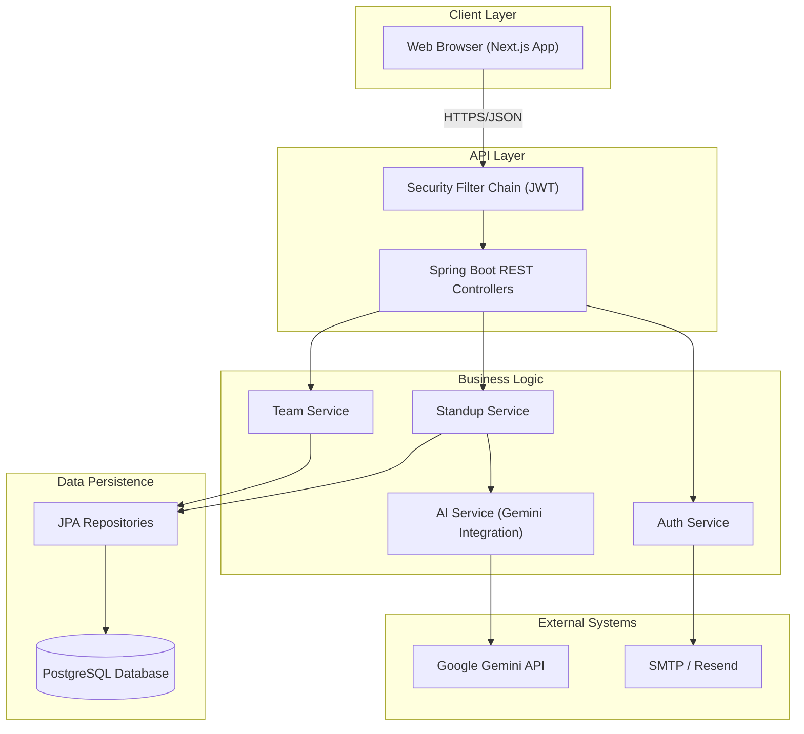
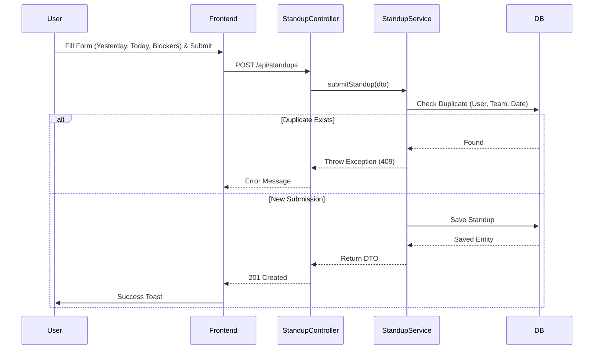
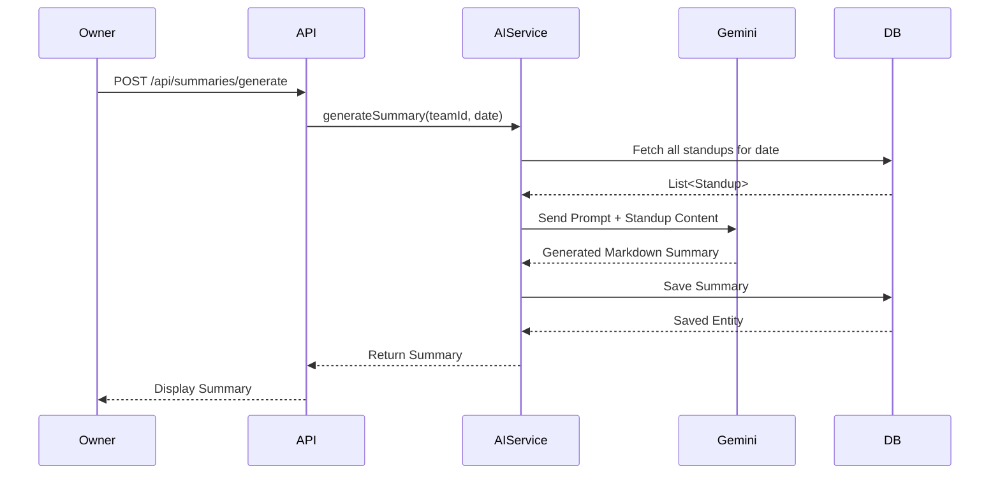

# StandUpStrip Architecture Document

**Document Version:** 1.0  
**Last Updated:** January 6, 2026  
**Status:** ✅ Implemented

---

## Introduction

This document outlines the overall project architecture for **StandUpStrip**, including backend systems, shared services, and non-UI specific concerns. Its primary goal is to serve as the guiding architectural blueprint for AI-driven development.

**Relationship to Frontend Architecture:**
This document is complemented by the [Frontend Architecture Document](./front-end-spec.md) which details the frontend-specific design. Core technology stack choices documented herein are definitive for the entire project.

### Starter Template or Existing Project
N/A - This was a greenfield project built from scratch with Next.js and Spring Boot.

### Change Log

| Date | Version | Description | Author |
|------|---------|-------------|--------|
| 2026-01-12 | 1.0 | Initial Architecture Document created retrospectively | System Architect |

---

## High Level Architecture

### Technical Summary
StandUpStrip employs a classic **3-tier architecture** with a clear separation of concerns: a Next.js frontend (Presentation Layer), a Spring Boot backend (Business Logic Layer), and a PostgreSQL database (Data Layer). The system is designed to be stateless and horizontally scalable, utilizing JWT for authentication. A key component is the integration with Google Gemini AI for generating standup summaries, abstracted via a service layer to ensure loose coupling.

### High Level Overview
Based on the PRD's Technical Assumptions:

1. **Architectural Style:** Monolithic Backend with separate Frontend (Client-Server).
2. **Repository Structure:** Monorepo (`frontend/`, `backend/`, `docs/`) for simplified code sharing and versioning.
3. **Service Architecture:** Monolith (Spring Boot) managing all domains (Auth, Teams, Standups).
4. **Primary Data Flow:** Client sends REST requests -> Backend validates & processes -> Data stored in PostgreSQL -> Async AI processing via Gemini API -> Client polls/fetches results.

### High Level Project Diagram



### Architectural and Design Patterns

- **Layered Architecture:** Strict separation (Controller -> Service -> Repository) - _Rationale:_ Improves maintainability and testability.
- **Repository Pattern:** Abstract data access logic using Spring Data JPA - _Rationale:_ Decouples business logic from database implementation.
- **Stateless Authentication:** JWT (JSON Web Tokens) - _Rationale:_ Enables horizontal scaling and simple client-side state management.
- **Adapter Pattern:** `AIService` interface - _Rationale:_ Allows swapping AI providers (e.g., Gemini to OpenAI) without changing business logic.
- **DTO Pattern:** Data Transfer Objects for API contracts - _Rationale:_ Decouples internal entity models from external API shape.

---

## Tech Stack

### Cloud Infrastructure
- **Provider:** Render / Railway (Backend), Vercel (Frontend), Neon (Database)
- **Key Services:** Managed PostgreSQL, Container Hosting, Edge Network
- **Deployment Regions:** US-East (for MVP latency optimization)

### Technology Stack Table

| Category | Technology | Version | Purpose | Rationale |
|----------|------------|---------|---------|-----------|
| **Language** | Java | 21 | Backend Logic | Type safety, performance, ecosystem maturity |
| **Language** | TypeScript | 5.x | Frontend Logic | Type safety, IDE support, catch errors early |
| **Framework** | Spring Boot | 4.0 | Backend Framework | Rapid development, dependency injection, robust security |
| **Framework** | Next.js | 15 | Frontend Framework | SSR/RSC capabilities, routing, optimization |
| **Database** | PostgreSQL | 15+ | Primary Data Store | ACID compliance, relational integrity, JSON support |
| **ORM** | Hibernate / JPA | 6.x | Data Access | Standard Java ORM, developer productivity |
| **AI** | Google Gemini | 2.0 Flash | AI Summarization | Cost-effective, high speed, large context window |
| **Security** | Spring Security | 6.x | Auth & Authorization | Industry standard, flexible filter chains |
| **Testing** | JUnit 5 | 5.x | Backend Testing | Standard Java testing framework |

---

## Data Models

### User
**Purpose:** Represents a registered user of the system.
**Key Attributes:**
- `id`: Long (PK)
- `email`: String (Unique, Indexed)
- `password_hash`: String
- `verified`: Boolean
- `created_at`: Timestamp
**Relationships:**
- One-to-Many with `TeamMember`
- One-to-Many with `Standup`

### Team
**Purpose:** Represents a group of users sharing standups.
**Key Attributes:**
- `id`: Long (PK)
- `name`: String
- `invite_code`: String (Unique, Indexed)
- `owner_id`: Long (FK to User)
- `deleted`: Boolean (Soft delete)
**Relationships:**
- One-to-Many with `TeamMember`
- One-to-One with `User` (Owner)

### Standup
**Purpose:** A daily status update from a user.
**Key Attributes:**
- `id`: Long (PK)
- `user_id`: Long (FK)
- `team_id`: Long (FK)
- `date`: LocalDate
- `yesterday_text`: Text
- `today_text`: Text
- `blockers_text`: Text
**Relationships:**
- Many-to-One with `User`
- Many-to-One with `Team`

### StandupSummary
**Purpose:** AI-generated summary of standups for a team/date.
**Key Attributes:**
- `id`: Long (PK)
- `team_id`: Long (FK)
- `date`: LocalDate
- `content`: Text (Markdown)
- `type`: Enum (DAILY, WEEKLY)
**Relationships:**
- Many-to-One with `Team`

---

## Components

### AuthComponent
**Responsibility:** Handles registration, login, token generation, and email verification.
**Key Interfaces:** `register()`, `login()`, `verifyEmail()`, `resetPassword()`
**Dependencies:** `UserRepository`, `EmailService`

### TeamComponent
**Responsibility:** Manages team lifecycle, membership changes, and settings.
**Key Interfaces:** `createTeam()`, `joinTeam()`, `removeMember()`
**Dependencies:** `TeamRepository`, `TeamMemberRepository`, `UserRepository`

### StandupComponent
**Responsibility:** CRUD operations for daily standups.
**Key Interfaces:** `submitStandup()`, `getStandupsByDate()`, `getHistory()`
**Dependencies:** `StandupRepository`, `TeamRepository`

### AIIntegrationComponent
**Responsibility:** Interacts with Google Gemini API to generate summaries.
**Key Interfaces:** `generateDailySummary()`, `generateWeeklySummary()`
**Dependencies:** `StandupRepository`, `GeminiClient`

---

## External APIs

### Google Gemini API
- **Purpose:** Content generation and summarization
- **Base URL:** `https://generativelanguage.googleapis.com`
- **Authentication:** API Key (via Header/Query param)
- **Rate Limits:** 15 RPM (Free Tier)
- **Key Endpoints:** `POST /v1beta/models/gemini-pro:generateContent`
- **Integration Notes:** Must handle timeouts gracefuly; implement fallback logic if API key is invalid or quota exceeded.

### Email Service (SMTP/Resend)
- **Purpose:** Transactional emails (Verification, Password Reset)
- **Authentication:** SMTP Credentials / API Key
- **Integration Notes:** Async sending recommended to avoid blocking HTTP threads.

---

## Core Workflows

### Standup Submission Flow


### AI Summary Generation Flow


---

## REST API Spec

```yaml
openapi: 3.0.0
info:
  title: StandUpStrip API
  version: 1.0.0
  description: API for daily standup management
servers:
  - url: /api
    description: Base API path
paths:
  /auth/register:
    post:
      summary: Register new user
      requestBody:
        content:
          application/json:
            schema:
              type: object
              properties:
                email: {type: string}
                password: {type: string}
                name: {type: string}
  /teams:
    post:
      summary: Create new team
      security:
        - bearerAuth: []
  /standups:
    post:
      summary: Submit standup
      security:
        - bearerAuth: []
components:
  securitySchemes:
    bearerAuth:
      type: http
      scheme: bearer
      bearerFormat: JWT
```

---

## Database Schema

```sql
CREATE TABLE users (
    id BIGSERIAL PRIMARY KEY,
    email VARCHAR(255) UNIQUE NOT NULL,
    password_hash VARCHAR(255) NOT NULL,
    name VARCHAR(100),
    verified BOOLEAN DEFAULT FALSE,
    created_at TIMESTAMP DEFAULT CURRENT_TIMESTAMP
);

CREATE TABLE teams (
    id BIGSERIAL PRIMARY KEY,
    name VARCHAR(100) NOT NULL,
    invite_code VARCHAR(8) UNIQUE NOT NULL,
    owner_id BIGINT REFERENCES users(id),
    deleted BOOLEAN DEFAULT FALSE,
    created_at TIMESTAMP DEFAULT CURRENT_TIMESTAMP
);

CREATE TABLE team_members (
    id BIGSERIAL PRIMARY KEY,
    team_id BIGINT REFERENCES teams(id),
    user_id BIGINT REFERENCES users(id),
    role VARCHAR(20) NOT NULL,
    joined_at TIMESTAMP DEFAULT CURRENT_TIMESTAMP,
    UNIQUE(team_id, user_id)
);

CREATE TABLE standups (
    id BIGSERIAL PRIMARY KEY,
    team_id BIGINT REFERENCES teams(id),
    user_id BIGINT REFERENCES users(id),
    date DATE NOT NULL,
    yesterday_text TEXT,
    today_text TEXT,
    blockers_text TEXT,
    created_at TIMESTAMP DEFAULT CURRENT_TIMESTAMP,
    UNIQUE(team_id, user_id, date)
);

CREATE INDEX idx_standups_team_date ON standups(team_id, date);
```

---

## Infrastructure and Deployment

### Infrastructure as Code
- **Managed By:** Platform (Vercel/Railway) configuration
- **Env Vars:** Manual configuration in dashboard

### Deployment Strategy
- **Frontend:** Git-push to Vercel (Auto-build & Deploy)
- **Backend:** Git-push to Railway/Render / Manual Docker build
- **CI/CD:** Basic CI on commit (Build check)

### Environments
- **Local:** Developer machine, Docker DB
- **Production:** Live environment, Managed DB

---

## Security

### Input Validation
- **Library:** Java Bean Validation (JSR 380) / Jakarta Validation
- **Location:** DTO level (@NotNull, @Size, @Email)
- **Rules:** All API inputs must be vetted before processing.

### Authentication & Authorization
- **Auth Method:** JWT (Bearer Token)
- **Patterns:** Spring Security Filter Chain
- **Password:** Bcrypt Hashing (strength 10)

### Secrets Management
- **Production:** Platform Environment Variables (Never committed to git)
- **Development:** `.env` file (gitignored)

---

*Document created using BMad-METHOD™ Architecture Template v2.0*
