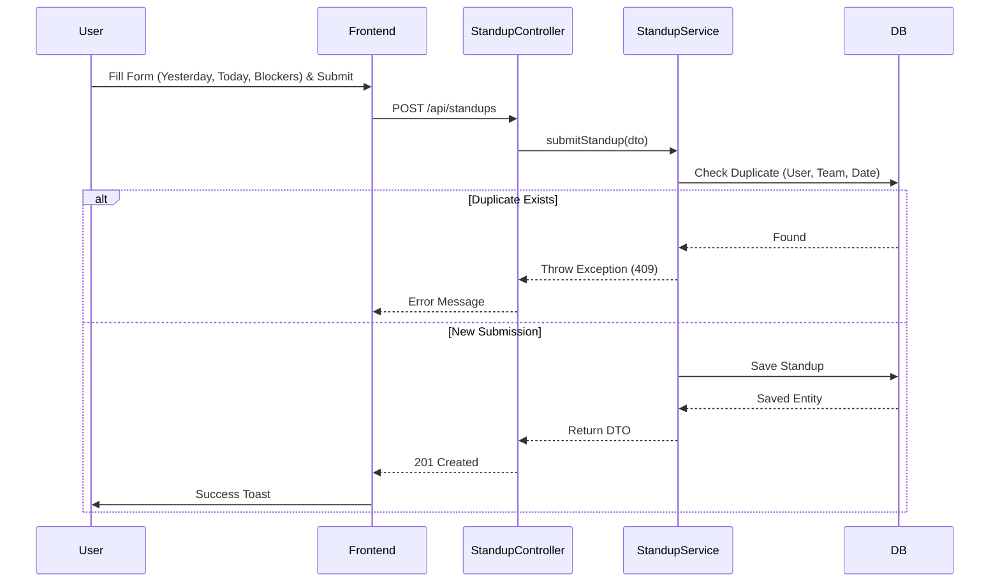
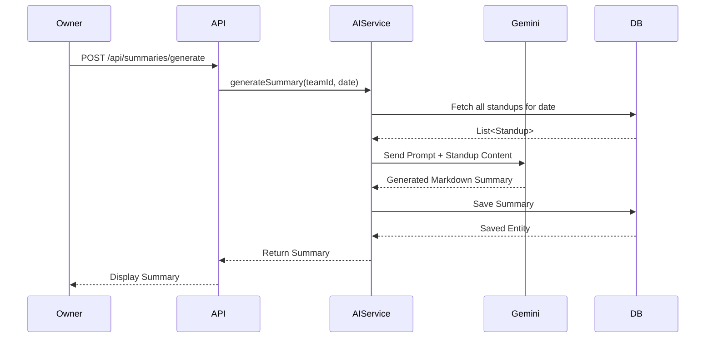

# Core Workflows

### Standup Submission Flow

```mermaid
sequenceDiagram
    participant User
    participant Frontend
    participant StandupController
    participant StandupService
    participant DB

    User->>Frontend: Fill Form (Yesterday, Today, Blockers) & Submit
    Frontend->>StandupController: POST /api/standups
    StandupController->>StandupService: submitStandup(dto)
    StandupService->>DB: Check Duplicate (User, Team, Date)
    alt Duplicate Exists
        DB-->>StandupService: Found
        StandupService-->>StandupController: Throw Exception (409)
        StandupController-->>Frontend: Error Message
    else New Submission
        StandupService->>DB: Save Standup
        DB-->>StandupService: Saved Entity
        StandupService-->>StandupController: Return DTO
        StandupController-->>Frontend: 201 Created
        Frontend->>User: Success Toast
    end
```

### AI Summary Generation Flow

```mermaid
sequenceDiagram
    participant Owner
    participant API
    participant AIService
    participant Gemini
    participant DB

    Owner->>API: POST /api/summaries/generate
    API->>AIService: generateSummary(teamId, date)
    AIService->>DB: Fetch all standups for date
    DB-->>AIService: List<Standup>
    AIService->>Gemini: Send Prompt + Standup Content
    Gemini-->>AIService: Generated Markdown Summary
    AIService->>DB: Save Summary
    DB-->>AIService: Saved Entity
    AIService-->>API: Return Summary
    API-->>Owner: Display Summary
```

---

