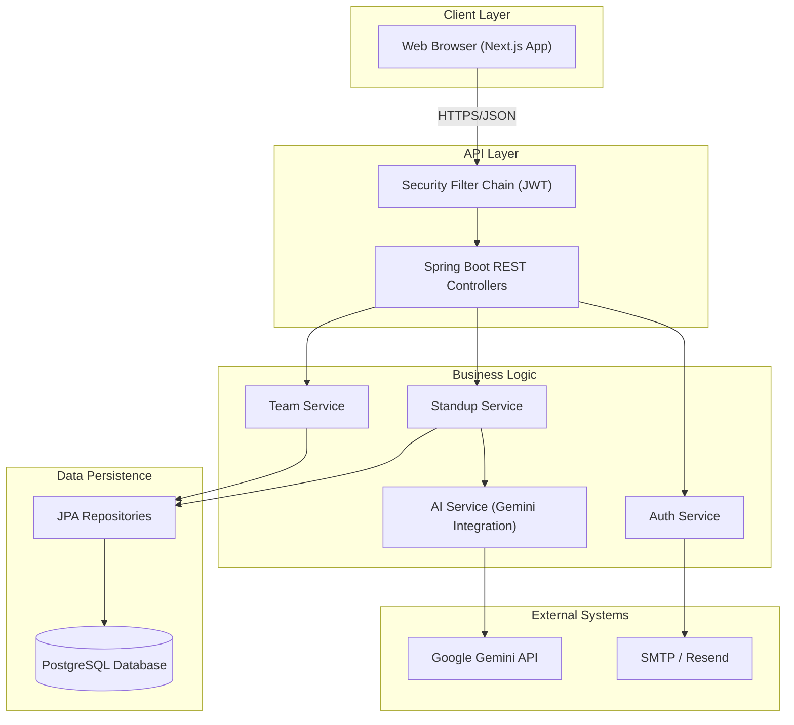

# High Level Architecture

### Technical Summary
StandUpStrip employs a classic **3-tier architecture** with a clear separation of concerns: a Next.js frontend (Presentation Layer), a Spring Boot backend (Business Logic Layer), and a PostgreSQL database (Data Layer). The system is designed to be stateless and horizontally scalable, utilizing JWT for authentication. A key component is the integration with Google Gemini AI for generating standup summaries, abstracted via a service layer to ensure loose coupling.

### High Level Overview
Based on the PRD's Technical Assumptions:

1. **Architectural Style:** Monolithic Backend with separate Frontend (Client-Server).
2. **Repository Structure:** Monorepo (`frontend/`, `backend/`, `docs/`) for simplified code sharing and versioning.
3. **Service Architecture:** Monolith (Spring Boot) managing all domains (Auth, Teams, Standups).
4. **Primary Data Flow:** Client sends REST requests -> Backend validates & processes -> Data stored in PostgreSQL -> Async AI processing via Gemini API -> Client polls/fetches results.

### High Level Project Diagram

### Architectural and Design Patterns

- **Layered Architecture:** Strict separation (Controller -> Service -> Repository) - _Rationale:_ Improves maintainability and testability.
- **Repository Pattern:** Abstract data access logic using Spring Data JPA - _Rationale:_ Decouples business logic from database implementation.
- **Stateless Authentication:** JWT (JSON Web Tokens) - _Rationale:_ Enables horizontal scaling and simple client-side state management.
- **Adapter Pattern:** `AIService` interface - _Rationale:_ Allows swapping AI providers (e.g., Gemini to OpenAI) without changing business logic.
- **DTO Pattern:** Data Transfer Objects for API contracts - _Rationale:_ Decouples internal entity models from external API shape.

---

