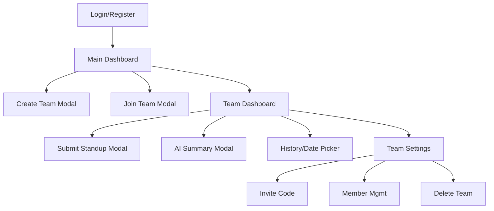
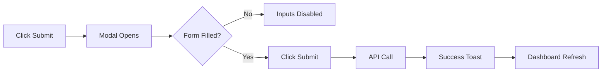
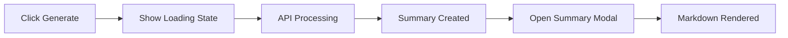

# StandUpStrip UI/UX Specification

**Document Version:** 1.0  
**Last Updated:** January 6, 2026  
**Status:** ✅ Implemented

---

## Introduction

This document defines the user experience goals, information architecture, user flows, and visual design specifications for **StandUpStrip**. It serves as the foundation for the frontend development, ensuring a cohesive and user-centered experience.

---

## Overall UX Goals & Principles

### Target User Personas
- **Tech Team Lead (Sarah):** Need to know team progress WITHOUT interrupting deep work. Values speed and aggregated insights.
- **Startup Founder (Mike):** Needs weekly visibility without attending daily meetings. Values high-level summaries and trends.
- **Remote Developer (Alex):** Wants to spend < 1 minute on admin tasks. Values frictionless input and clear expectations.

### Usability Goals
- **Speed:** Submission < 60 seconds.
- **Zero Config:** Valuable immediately after signup.
- **Clarity:** "Don't make me think" navigation.
- **Visibility:** Status of the team at a glance.

### Design Principles
1. **Speed Over Features:** Every interaction must be instant.
2. **Summary First:** Show the insight (AI summary) before the raw data.
3. **Async Native:** No real-time expectations; pull-based updates.
4. **Minimal Friction:** Remove every possible click between login and submission.

---

## Information Architecture (IA)

### Site Map

### Navigation Structure
- **Global:** Top Bar (Logo, User Profile Dropdown)
- **Primary:** Dashboard (Team List) -> Team Detail
- **Contextual:** Within Team Detail (Date Navigation, Action Buttons)

---

## User Flows

### Standup Submission Flow
**User Goal:** Submit daily update quickly.
**Entry Points:** Team Dashboard -> "Submit Standup" Button.

**Edge Cases:**
- User already submitted today: Show "Edit" button/modal instead.
- API Error: Show error toast, keep modal open with data preserved.

### AI Summary Generation Flow
**User Goal:** Get a quick synthesis of team activity.
**Entry Points:** Team Dashboard -> "Generate Summary" Button.

---

## Wireframes & Mockups

### Key Screen Layouts

#### Team Dashboard
**Purpose:** Central hub for daily activity.
**Key Elements:**
- **Header:** Team Name, Settings Link.
- **Controls:** Date Picker, "Submit Standup" CTA.
- **Summary Banner:** "AI Summary Available" or "Generate" button.
- **Standup Grid:** Cards for each member (Name, Time, 3 Columns: Yesterday/Today/Blockers).
- **Heatmap:** Contribution graph at bottom.

#### Standup Modal
**Purpose:** Focused input.
**Key Elements:**
- **Yesterday Input:** Textarea (autofocus).
- **Today Input:** Textarea.
- **Blockers Input:** Textarea (optional).
- **Character Count:** x/2000.
- **Action:** Primary "Submit" button.

---

## Component Library / Design System

### Design System Approach
Leverage **shadcn/ui** (built on Radix UI + Tailwind CSS) for a robust, accessible foundation. Custom components built on top of these primitives.

### Core Components

#### `StandupCard`
- **Purpose:** Display single user entry.
- **Variants:** Own (Approachable/Editable) vs Others (Read-only).
- **States:** Loading (Skeleton), Error, Empty.

#### `ParticipationHeatmap`
- **Purpose:** Visual activity history.
- **Usage:** Displays last 6 months. Tooltip on hover.

#### `SummaryModal`
- **Purpose:** Display Markdown content from AI.
- **Usage:** Clean typography, distinct headers for "Overview", "Themes", "Blockers".

---

## Branding & Style Guide

### Color Palette
| Color Type | Hex Code | Usage |
|------------|----------|-------|
| Primary | `#2563eb` (Blue-600) | Buttons, Links, Active States |
| Background | `#ffffff` / `#f9fafb` | Page background, Cards |
| Text Main | `#111827` (Gray-900) | Headings, Body text |
| Text Muted | `#6b7280` (Gray-500) | Meta data, Placeholders |
| Success | `#10b981` | Completed actions, "Submitted" status |
| Danger | `#ef4444` | Delete actions, "Blockers" highlight |

### Typography
- **Font Family:** Inter (Sans-serif)
- **H1:** Bold, 24px-30px (Dashboard Titles)
- **H2:** Semibold, 20px (Section Headers)
- **Body:** Regular, 14px-16px (Standup text)

### Iconography
- **Library:** Lucide React
- **Usage:** Minimal use. Icons for actions (Trash, Edit, Settings) and indication (Checkmark, Warning).

---

## Accessibility Requirements

### Compliance Target
**Standard:** WCAG 2.1 AA

### Key Requirements
1. **Forms:** All inputs must have associated labels (visible or accessible).
2. **Keyboard:** Full navigation support (Tab order, Enter/Space to activate).
3. **Contrast:** Text/Background ratio > 4.5:1.
4. **Modals:** Focus trap within modal when open; ESC to close.
5. **Screen Readers:** ARIA labels for icon-only buttons (e.g., "Delete Standup").

---

## Responsiveness Strategy

### Breakpoints
- **Mobile:** < 768px (Single column layout)
- **Tablet:** 768px - 1024px (Two column grid)
- **Desktop:** > 1024px (Three column grid)

### Adaptation Patterns
- **Standup Grid:** Collapses from 3 -> 2 -> 1 column.
- **Navigation:** Top bar simplifies; text links may become icons or hamburger menu (if complexity grows).
- **Modals:** Full screen on mobile vs centered dialog on desktop.

---

## Animation & Micro-interactions

### Motion Principles
- **Fast:** Max 200ms duration.
- **Subtle:** Fade-ins, slight scales.

### Key Animations
- **Toast:** Slide in from bottom-right (Success/Error feedback).
- **Modal:** Quick fade-in backdrop + scale-in content.
- **Skeleton:** Pulse animation while data fetches.

---

## Performance Considerations

### Performance Goals
- **Page Load:** < 1.5s (LCP)
- **Interaction Response:** < 100ms (INP)
- **AI Wait:** < 10s (Show clear "Thinking..." state)

### Design Strategies
- **Optimistic UI:** (Future) Show submission immediately before API confirms.
- **Skeletons:** Reduce perceived load time.
- **Client-side Caching:** React Query for instant navigation between dates.

---

## Next Steps

1. **Development:** Implement frontend using Next.js 15 + shadcn/ui.
2. **Review:** Verify implementation against wireframes and accessibility standards.
3. **Feedback:** Gather user feedback on submission flow friction.

---

*Document created using BMad-METHOD™ Frontend Spec Template v2.0*
