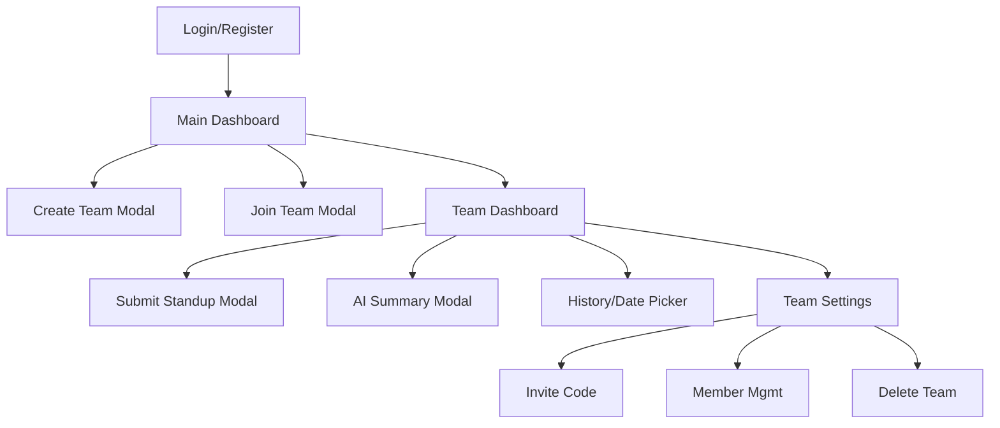

# Information Architecture (IA)

### Site Map

### Navigation Structure
- **Global:** Top Bar (Logo, User Profile Dropdown)
- **Primary:** Dashboard (Team List) -> Team Detail
- **Contextual:** Within Team Detail (Date Navigation, Action Buttons)

---

