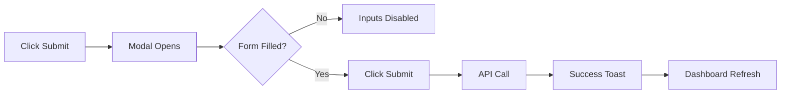
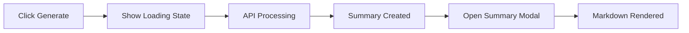

# User Flows

### Standup Submission Flow
**User Goal:** Submit daily update quickly.
**Entry Points:** Team Dashboard -> "Submit Standup" Button.

**Edge Cases:**
- User already submitted today: Show "Edit" button/modal instead.
- API Error: Show error toast, keep modal open with data preserved.

### AI Summary Generation Flow
**User Goal:** Get a quick synthesis of team activity.
**Entry Points:** Team Dashboard -> "Generate Summary" Button.

---

